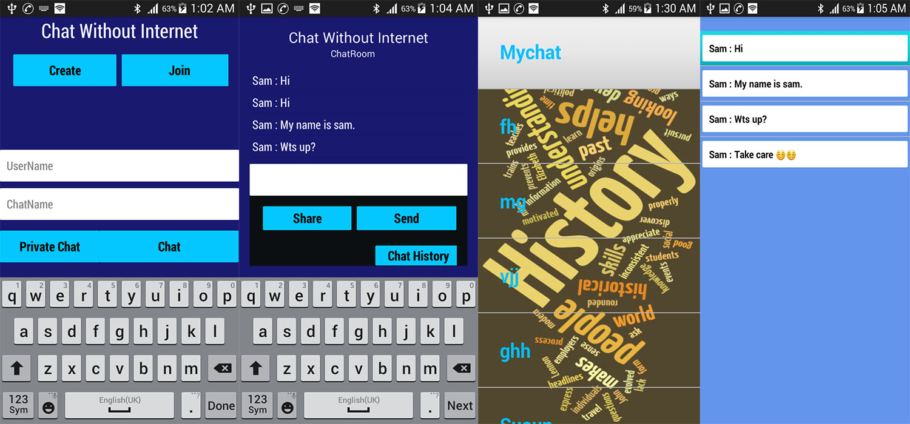

# ChatWithoutInternet - Android Based Mobile Application
Project ChatWithoutInternet is an android based mobile chatting application 
that doesn’t use any internet connection to transfer data between devices. This uses WiFi technology to transfer data.

## Overview
[Download APK Here](https://drive.google.com/file/d/0BybfOyhXrtXnck4tSVRmcjRzcEE/view?usp=sharing)
